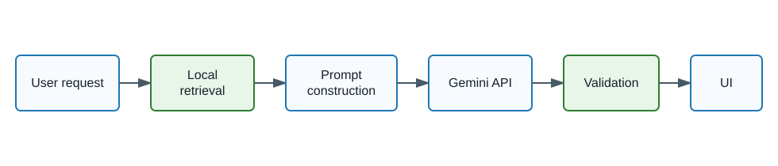
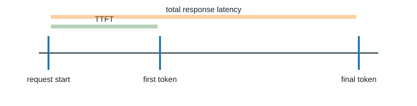

# gemini-llm-latency-lab

An educational Python repository for learning how to reduce latency in LLM applications that call the Google Gemini API. The application code in this repository is open source under MIT. Google Gemini is a hosted proprietary model accessed through an API; this license does not apply to Gemini models or Google's API service.

This is a learning lab, not a production benchmark of Google infrastructure. Results vary with network conditions, rate limits, model load, region, prompt caching, account configuration, and local hardware. Treat every benchmark as illustrative for your environment, never as universally reproducible.

No SAP HANA, LangChain, LlamaIndex, or proprietary vector database is used. Local retrieval uses TF-IDF from scikit-learn so the example stays transparent and easy to inspect.

## Architecture



The API and demos share one Gemini client wrapper. Set `USE_MOCK_GEMINI=true` for offline tests, demos, and CI. Set it to `false` and provide `GEMINI_API_KEY` for live Gemini Developer API calls.

## Current Gemini Model Defaults

The defaults are configurable because model availability changes:

```env
GEMINI_FAST_MODEL=gemini-2.5-flash-lite
GEMINI_QUALITY_MODEL=gemini-2.5-flash
```

On August 22, 2026, the official Gemini model documentation still lists both `gemini-2.5-flash-lite` and `gemini-2.5-flash`, while also listing newer Gemini 3 model families. Keep these environment variables explicit and re-check the official docs when you run live tests.

## Latency Metrics



TTFT is time to first token. Total latency is time to final response. P50 is the median request; P95 is a high-tail request. Non-streaming requests do not directly measure TTFT in this lab, so TTFT is reported as unavailable for them.

## Seven Techniques

1. Use the smallest model that passes a tested quality target.
2. Generate fewer output tokens.
3. Send less irrelevant context.
4. Reduce sequential model calls.
5. Run independent operations concurrently.
6. Stream responses to improve perceived latency.
7. Keep deterministic tasks in Python code.

The continuous loop is: measure -> find the bottleneck -> optimize -> re-evaluate latency and quality.

## Setup

```bash
git clone <repository-url>
cd gemini-llm-latency-lab
python -m venv .venv
source .venv/bin/activate
pip install -r requirements.txt
cp .env.example .env
pytest
uvicorn latency_lab.api:app --reload
streamlit run dashboard/app.py
```

Windows PowerShell activation:

```powershell
python -m venv .venv
.\.venv\Scripts\Activate.ps1
pip install -r requirements.txt
Copy-Item .env.example .env
```

For local development and CI, keep:

```env
USE_MOCK_GEMINI=true
```

To run live Gemini experiments, create an API key in Google AI Studio, place it in `.env`, and set:

```env
USE_MOCK_GEMINI=false
GEMINI_API_KEY=your-key-here
```

Never commit `.env`.

## Commands

```bash
pytest
pytest -m live
ruff check .
ruff format --check .
mypy src
uvicorn latency_lab.api:app --reload
streamlit run dashboard/app.py
python scripts/run_all_demos.py
python scripts/run_benchmark.py
python scripts/create_charts.py
```

Run each demo directly:

```bash
python -m latency_lab.demos.measure_latency
python -m latency_lab.demos.compare_models
python -m latency_lab.demos.limit_output
python -m latency_lab.demos.reduce_context
python -m latency_lab.demos.combine_calls
python -m latency_lab.demos.parallel_tasks
python -m latency_lab.demos.stream_response
python -m latency_lab.demos.deterministic_vs_llm
```

The real client uses the official modern SDK import:

```python
from google import genai
```

## Create a Gemini API Key

1. Open Google AI Studio.
2. Choose **Get API key**.
3. Create or select a project.
4. Copy the key into your local `.env` file as `GEMINI_API_KEY=...`.
5. Keep `.env` private and rotate the key immediately if it is exposed.

Makefile shortcuts:

```bash
make install
make test
make lint
make format
make api
make dashboard
make demo
make benchmark
```

## API

Endpoints:

```text
GET  /health
POST /generate
POST /generate/stream
POST /benchmark
POST /classify
POST /route
GET  /experiments
```

Example:

```bash
curl -X POST http://127.0.0.1:8000/generate \
  -H "content-type: application/json" \
  -d '{"prompt":"Classify this support request: I cannot sign in."}'
```

The health endpoint does not make a paid Gemini request. API keys are not printed, logged, returned, or included in downloaded benchmark files.

## Repository Structure

```text
assets/       SVG diagrams
data/         small labelled datasets and support documents
docs/         concept-by-concept tutorials
src/          reusable Python package and demos
dashboard/    Streamlit dashboard
scripts/      benchmark and chart helpers
tests/        offline unit and API tests
results/      generated benchmark outputs, ignored by git
```

## Suggested Learning Sequence

Start with `docs/01-measuring-latency.md`, then run `python scripts/run_all_demos.py` in mock mode. After that, enable a real API key and compare your live results with the mock results. Watch both quality and latency; a faster response is not useful if it fails the application requirement.

## Security, Cost, and Limitations

Live experiments may use API quota and incur cost. Benchmark output is environment-specific. Mock mode is deterministic and useful for learning the mechanics, but mock measurements are not Gemini performance measurements. TF-IDF is intentionally simple and not a production RAG system.

## Official Documentation

- Gemini API models: https://ai.google.dev/gemini-api/docs/models
- Gemini API quickstart and API key: https://ai.google.dev/gemini-api/docs/quickstart
- Google Gen AI Python SDK: https://github.com/googleapis/python-genai
