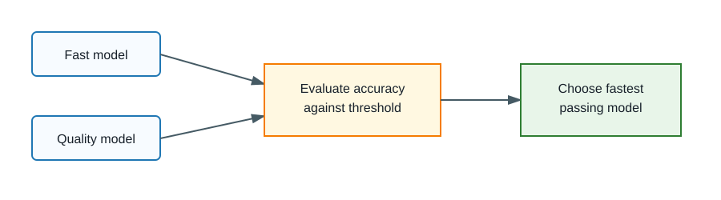

# 02. Model Selection

## Core idea

Use the smallest model that meets a tested quality requirement.

## Why it affects latency

Smaller or faster models often return sooner and cost less, but only if they still satisfy the task quality target.

## Before implementation

Pick a model because one prompt looked good.

## Optimized implementation

Evaluate a labelled dataset with at least 30 examples, compute accuracy and latency, then choose the fastest model that passes the configured threshold.



## How to run the example

```bash
USE_MOCK_GEMINI=true python -m latency_lab.demos.compare_models
```

## Example terminal output, illustrative

```text
Model                 Accuracy   P50     P95     Passes quality
gemini-2.5-flash-lite  93.8%     43      50      Yes
gemini-2.5-flash       96.9%     75      82      Yes

Recommended model: gemini-2.5-flash-lite
Reason: It is the lowest-latency model that passes the quality target.
```

## Metrics to compare

Accuracy, P50 latency, P95 latency, token counts, failures, and escalation rate for routing.

## Interpretation

Choose the fastest passing model, not automatically the smallest model.

## Limitations

The dataset is small and educational. Add your real labels before making product decisions.

## Production considerations

Route ambiguous or low-confidence requests to a stronger model and track how often escalation occurs.

