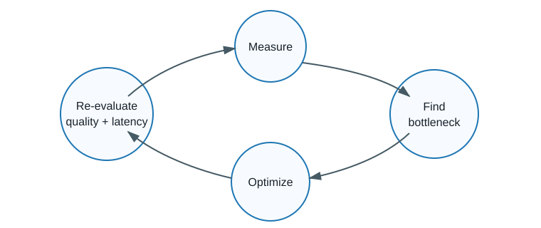

# 09. Optimization Loop

## Core idea

Continuously measure, find the bottleneck, optimize, and re-evaluate latency and quality.



## Why it affects latency

LLM systems drift as prompts, datasets, models, network conditions, and traffic patterns change.

## Before implementation

Apply one optimization once and assume it stays best.

## Optimized implementation

Save timestamped CSV and JSON results under `results/`, compare runs, and keep quality gates visible.

## How to run the example

```bash
USE_MOCK_GEMINI=true python scripts/run_benchmark.py
```

## Example terminal output, illustrative

```text
Saved CSV: results/20260822-120000-measure-latency.csv
Saved JSON: results/20260822-120000-measure-latency.json
```

## Metrics to compare

Latency, TTFT, token usage, quality score, error rate, and throughput.

## Interpretation

The best change is the one that improves latency while preserving the application quality requirement.

## Limitations

Small benchmark runs have noise. Live API results are not universally reproducible.

## Production considerations

Automate benchmarks, store metadata, segment by request type, and alert when quality or tail latency regresses.

